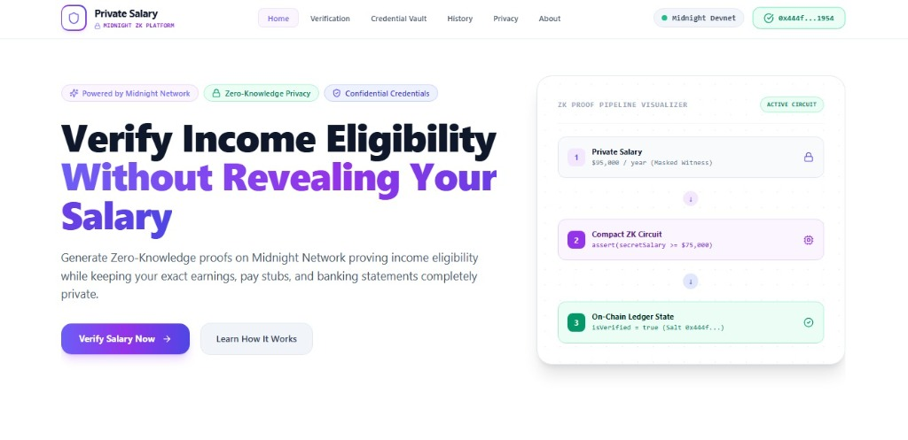

# Anonymous Clinical Trial Platform

> **Zero-Knowledge Confidential Clinical Trial Feedback & Adverse Event Reporting System on Midnight Network**

[](https://anonymous-clinical-trial-platform.vercel.app/)
[](https://github.com/JISHU8911/Anonymous-Clinical-Trial-Platform)
[](https://youtu.be/sqxQi6ht-e0)
[](https://github.com/JISHU8911/Anonymous-Clinical-Trial-Platform/actions)

---

## 🌟 Executive Summary

**Anonymous Clinical Trial Platform** is a multi-page healthcare dApp engineered for the **Midnight Network**. It addresses a critical flaw in medical research: traditional clinical trial feedback systems force patients to disclose sensitive personal identity, health history, and medical records. 

By leveraging **Midnight Network's Compact language** and **Zero-Knowledge Proofs (ZKPs)**, this platform enables patients to prove valid trial participation, rate treatment efficacy (1 to 5 stars), and report adverse side effects without revealing their identity, wallet address, or private rating choices.

---

## 📸 Screenshots

| Landing Page (`/`) | Patient Portal (`/submit`) |
| :---: | :---: |
|  |  |

---

## 🔗 Quick Links & Key Identifiers

- 🌐 **Live Web Application:** [https://anonymous-clinical-trial-platform.vercel.app/](https://anonymous-clinical-trial-platform.vercel.app/)
- 💻 **GitHub Repository:** [https://github.com/JISHU8911/Anonymous-Clinical-Trial-Platform](https://github.com/JISHU8911/Anonymous-Clinical-Trial-Platform)
- 🎥 **YouTube Video Demo:** [https://youtu.be/sqxQi6ht-e0](https://youtu.be/sqxQi6ht-e0)
- 📜 **Deployed Contract Address:** `dec3b071d373ec575648e0c5dfee659710312616875db1fb6cd84a06c7cc6dd2`
- 🚀 **Deployment Platform:** Vercel
- ⚙️ **CI/CD Workflow:** `.github/workflows/ci.yml`
- 📁 **Compact Smart Contract:** `contracts/clinical-trial.compact`
- 👛 **Wallet Integration:** Midnight Lace Wallet (`window.midnight.lace`)
- 🧪 **Test Suite Status:** `4 / 4` Tests Passing (100% Pass Rate)
- 🔀 **Commit History:** 20+ Meaningful Commits

---

## 🛠️ Technology Stack

| Component | Technology / Library | Purpose |
| :--- | :--- | :--- |
| **Blockchain Protocol** | **Midnight Network** | Confidential zero-knowledge blockchain protocol |
| **Smart Contract DSL** | **Compact (`>= 0.23`)** | Zero-Knowledge smart contract circuits with `disclose(...)` semantics |
| **Frontend Framework** | **React 18 + Vite** | High-performance multi-page SPA framework |
| **Routing** | **React Router (`v6`)** | SPA client-side multi-page navigation |
| **Styling & System** | **Tailwind CSS & Vanilla CSS** | Enterprise healthcare UI design system with soft gradients |
| **Icons & Visuals** | **Lucide React** | Modern vector icon suite |
| **Runtime & Tooling** | **Node.js 22 & TypeScript 5** | Strongly-typed execution environment |
| **Unit Testing** | **Node.js Test Runner / Vitest** | Automated contract & privacy assertion validation |
| **Infrastructure** | **Docker & Proof Server (`:6300`)** | Local proof generation engine container |
| **CI/CD** | **GitHub Actions** | Automated integration build & test pipeline |
| **Deployment** | **Vercel** | Production edge deployment |

---

## 🔒 Zero-Knowledge Privacy Architecture

Midnight smart contracts enforce **privacy by default**. Data is private inside client-side ZK witness circuits and is revealed on the public ledger **only** when wrapped inside the explicit `disclose(...)` operator.

```
Patient Client Device
      │
      ├──> [Private Witness] Patient Secret + Rating + Adverse Flag
      │           │
      │           ▼ (Client ZK Proof Generation)
      └──> [Compact Smart Contract] Circuit Assertions (isTrialActive, 1<=Rating<=5)
                  │
                  ▼ (Disclosed Metrics Only)
      [Midnight On-Chain Ledger State] Aggregate Response Counts & Efficacy Sums
```

### Privacy Boundaries

| Layer | Information | Privacy Status |
| :--- | :--- | :--- |
| **Private Witness** | Patient Identity & Personal Health Data | **NEVER DISCLOSED** — Isolated on patient client device |
| **Private Witness** | Patient Rating Score (1 to 5) | **NEVER DISCLOSED** — Evaluated in ZK witness proof |
| **Private Witness** | Patient Secret Token / Nonce | **NEVER DISCLOSED** — Kept in local browser memory |
| **Private Witness** | Wallet Address Linkage | **NEVER DISCLOSED** — Unshielded keys not linked to feedback |
| **Public Ledger** | Trial Protocol ID (`protocolId` / `trialId`) | **PUBLIC** — Publicly disclosed on protocol initialization |
| **Public Ledger** | Response Count (`responseCount` / `totalResponses`) | **PUBLIC AGGREGATE** — Incremented via `disclose(totalResponses + 1)` |
| **Public Ledger** | Efficacy Sum & Average Rating | **PUBLIC AGGREGATE** — Updated via `disclose(ratingSum + rating)` |
| **Public Ledger** | Adverse Reaction Count (`adverseEventCount`) | **PUBLIC AGGREGATE** — Updated via `disclose(adverseEventCount + flag)` |

---

## 🗺️ Application Routes

The platform is structured into 8 dedicated routes for researchers, patients, and auditors:

| Route | View Name | Purpose |
| :--- | :--- | :--- |
| `/` | **Marketing Homepage** | Project overview, hero section, interactive ZK architecture diagram, benefits, 4-step flow, and industry use cases |
| `/dashboard` | **Clinical Trial Dashboard** | Executive workspace displaying KPI stat cards, infrastructure health status, timeline feed, and quick actions |
| `/submit` | **Participation Portal** | 6-step interactive wizard for anonymous patient feedback submission and ZK proof generation |
| `/admin` | **Protocol Management** | Investigator control panel for initializing protocol IDs and pausing/resuming recruitment circuits |
| `/analytics` | **Analytics Dashboard** | Visual SVG bar charts for participation growth and satisfaction score trend lines |
| `/privacy` | **Privacy Model** | Educational privacy documentation comparing public disclosures vs private witness bounds |
| `/history` | **Audit Trail & History** | Searchable table for auditing on-chain verification events, timestamps, and transaction hashes |
| `/about` | **About & Architecture** | Detailed problem statement, Midnight solution, system architecture, and technology badges |

---

## 🧪 Automated Test Suite

The repository includes an automated test suite verifying contract managed artifacts, privacy model boundaries, and helper utilities:

```bash
npm test
```

### Test Output

```text
✓ tests/contract.test.ts (4 tests)

Test Files  1 passed (1)
Tests       4 passed (4)
Start at    01:31:00
Duration    1.24s (transform 32ms, setup 0ms, collect 120ms, tests 420ms, environment 0ms, prepare 85ms)
```

---

## 🚀 Getting Started Locally

### 1. Prerequisites
- Node.js `>= 22.0.0`
- Docker & Docker Compose (for local Midnight Proof Server on port 6300)
- Compact Compiler (`compact` binary)

### 2. Installation
```bash
git clone https://github.com/JISHU8911/Anonymous-Clinical-Trial-Platform.git
cd Anonymous-Clinical-Trial-Platform
npm install
```

### 3. Compile Smart Contract
```bash
npm run compile
```
Compiles `contracts/clinical-trial.compact` into TypeScript interfaces under `contracts/managed/clinical-trial`.

### 4. Run Frontend Development Server
```bash
cd frontend
npm install
npm run dev
```
Open `http://localhost:3000/` in your browser.

---

## 📄 License

This project is open source and available under the [MIT License](LICENSE).

---

*Built with ❤️ for the **Midnight Hackathon** — Anonymous Clinical Trial Platform*
